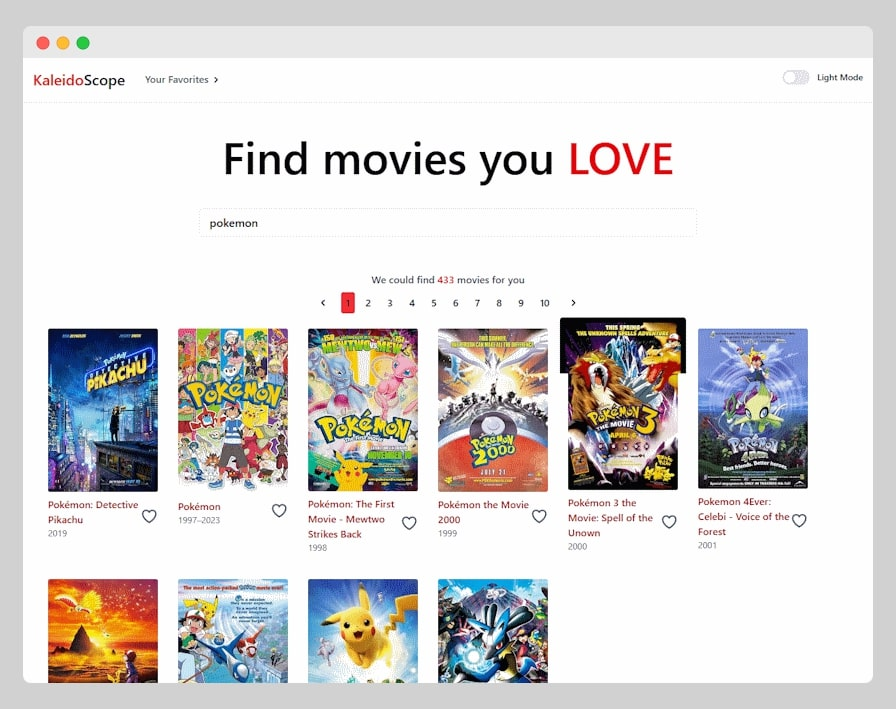

# 🎬 KaleidoScope 

A React-based movie search application that allows users to explore movies, view details, and manage a favorites list.  

## 🚀 Features  

- 🔍 **Search Movies**: Type a movie name to fetch results from the [OMDb API](https://www.omdbapi.com/).  
- 🖼 **Movie List**: Display search results in a responsive grid layout using Flexbox.  
- 📄 **Movie Details**: Click on a movie to view additional details.  
- ❤️ **Favorites List**: Add/remove movies from a Redux-powered favorites list.  
- ⚡ **Optimized Performance**: Uses `useCallback` and `useMemo` for better efficiency.  

## 🛠️ Tech Stack  

- **React** (Functional Components, Hooks)  
- **Redux** (State Management for Favorites)  
- **Fetch API** (OMDb API Integration)  
- **Flexbox/Grid** (Responsive UI)  

## 📸 Screenshots  



## 🏗️ Installation  

1. Clone the repository:  
    ```bash
    git clone https://github.com/SachinDas246/kaleidoscope.git
    cd movie-explorer
    ```
2. Install dependencies:  
    ```bash
    npm install
    ```
3. Create a .env file and add your OMDb Url with API key:
    ```env
    VITE_OMDB_BASE_URL=http://www.omdbapi.com/?apikey=<key>
    ```
4. Start the development server:
    ``` bash
    npm run dev
    ```
## 🌍 Deployment
The application is deployed on Vercel/Netlify: [Live Demo](https://kaleidoscope246.vercel.app/)
### 📜 Bonus Features   
✅ Pagination  
✅ Loading Indicator  
✅ Dark Mode  

📧 Contact
For any queries, feel free to reach out.

🔗 GitHub Repository: [SachinDas246/kaleidoscope](https://github.com/SachinDas246/kaleidoscope)

Let me know if you want any modifications! 😊